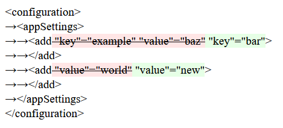

# XmlDiff

Simple Xml diff tool based on Linq to Xml.
The main idea behind was to create a tool for a quick and flexible structured *.config files comparision.

## Usage

Basic usage is that you have two ```XElement``` instances ```sourceXml``` and ```resultXml```.
Then you can pass it to ```XmlComparer``` and inspect the result.
```
var comparer = new XmlComparer();
var diff = comparer.Compare(sourceXml, resultXml);
var isChanged = diff.IsChanged;
```

Feel free to use a predefined or custom Visitors
```
var visitor = new HtmlOutputVisitor();
visitor.Visit(diff);
return visitor.Result;
```

## Built-in Visitors

### ToStringVisitor 
Default output for ```diff.ToString()```

```
= Element "configuration"
...= Element "applicationSettings"
......= Element "BusinessValues"
.........= Element "setting" "name"="IsProduction" "serializeAs"="String"
............= Element "value"
...............- Value: "False"
...............+ Value: "True"
...= Element "appSettings" "file"="Personal.config"
......= Element "add" "key"="webpages:Version" "value"="1.0.0.0"
.........+ Attribute: "value" with value: "1.0.0.0"
...= Element "system.web"
......- Element "authentication" "mode"="Forms"
```
### HtmlVisitor 

Prettified version



### XdtVisitor
Generates  [XML Document Transformation file](https://msdn.microsoft.com/en-us/library/dd465326%28v=vs.110%29.aspx?f=255&MSPPError=-2147217396)
```
<configuration>
    <appSettings>
        <add key="bar" xdt:Transform="SetAttributes(key)" />
        <add key="hello" value="new" xdt:Locator="Match(key)" xdt:Transform="SetAttributes(value)" />
    </appSettings>
</configuration>
```

## Custom Visitors

In order to create your own visitor you need to implement `IDiffVisitor` or `IDiffParamsVisitor` interface 

## License
This project is licensed under the MIT License - see the [LICENSE.md](LICENSE.md) file for details

## Acknowledgments
Thanks to [**Keith Hall**](https://github.com/keith-hall) for contributing